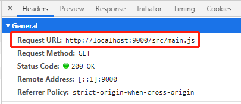
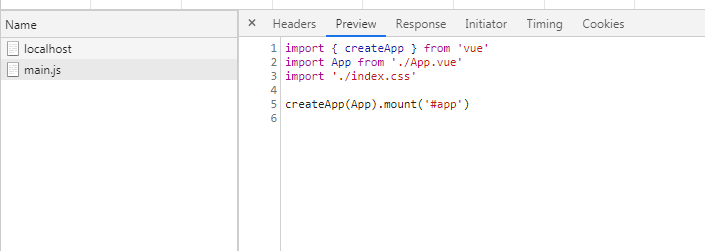
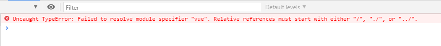
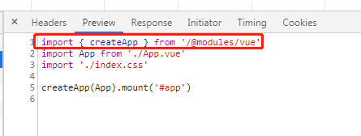
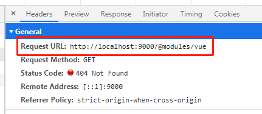
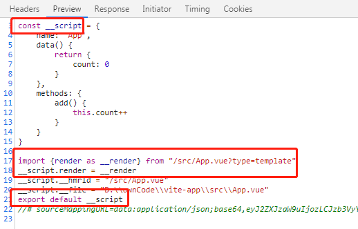
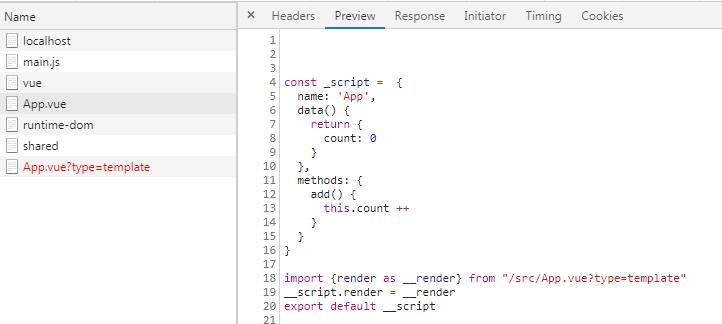
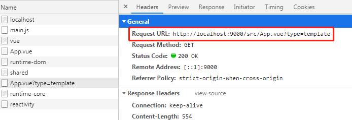

# vite-analysis
How to analyze vite
### vite原理实现
```javascript
<script type="module" src="/src/main.js"></script>
``` 
type="module" 当遇见import依赖时，浏览器会直接发起http请求对应的模块文件 vite就是通过拦截请求实现的运行时编译（更快 更高效）  webpack为打包时编译 需要将所有的文件都进行编译 会慢很多、
#### 思路：
    

#### 步骤： 
#### 一、解析js文件
当浏览器访问访问根目录 服务端渲染我们的index.html 而index.html中有下面代码：
```javascript
<script type="module" src="/src/main.js"></script>
``` 
所以会想浏览器发出请求 



服务端响应结果


此时浏览器将会报错 **Uncaught TypeError: Failed to resolve module specifier "vue". Relative references must start with either "/", "./", or "../".**

原因是因为浏览器无法解析模块 相对引用必须以"/"、"./"或"../"开头 


解决上面报错
```javascript
// 改造.js文件内容  不是/ ./ ../ 开头的import 替换成/@modules/开头的
export function reWriteImport(content) {
  const reg = / from ['|"]([^'"]+)['|"]/g
  return content.replace(reg, function($, $1) {
    return $1.startsWith('./') ? $ : ` from '/@modules/${$1}'`
  })
}
```


2、浏览器发出以/@modules开头的请求 获取vue资源
 

此时服务端找不到该资源，所以会返回404 我们需要将以/@modules开头的请求 在 node_modules中获取资源 

**注意:** node_modules寻找路径规则  例如找vue  node_modules -> vue -> package.json ->查找module （main是使用require时使用路径  module是使用es6import时走的路径） 这里我们找到module

#### 二、解析.vue单文件组件
.vue的文件浏览器是不认识的  import的时候只认识js 

1、将.vue单文件文件 拆成script  template->render函数 拼成一个对象
我们需要将.vue文件转换成下图 vite返回的


这一步我们需要做以下4件事

1、export default 转成 const __script 

2、添加 import {render as __render} from "/src/App.vue?type=template"

3、添加__script.render = __render

4、添加 export default __script

完成后


当解析到import {render as __render} from "/src/App.vue?type=template"浏览器会发出请求 如下图：


解析type=template请求
```javascript
 // 解析我们的template 编译成render函数 需要用到@vue/compiler-dom
  const template = descriptor.template
  const render = compilerDom.compile(template.content, { mode: "module" }).code
  // console.log(render)
  ctx.type = 'application/javascript'
  ctx.body = reWriteImport(render)
```
上面打印出的render:
```javascript
import { createVNode as _createVNode, toDisplayString as _toDisplayString, Fragment as _Fragment, openBlock as _openBlock, createBlock as _createBlock } from "vue"

export function render(_ctx, _cache) {
  return (_openBlock(), _createBlock(_Fragment, null, [
    _createVNode("div", null, "Hello World"),
    _createVNode("h1", { class: "count" }, _toDisplayString(_ctx.count), 1 /* TEXT */),
    _createVNode("p", {
      class: "add-btn",
      onClick: _ctx.add
    }, "增加", 8 /* PROPS */, ["onClick"])
  ], 64 /* STABLE_FRAGMENT */))
}
```
至此  我们就基本实现了mini版的vite  进行单文件和文件的解析